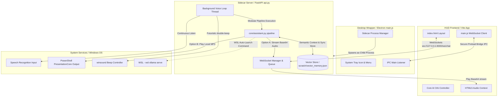
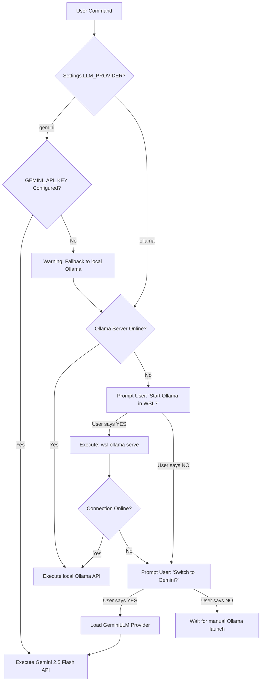

# 🏛️ JARVBOI Desktop Application Architecture & Data Flow

Welcome to the architectural documentation for **Jarvboi**, a premium local AI voice assistant styled after JARVIS. This document details the system design, component interactions, runtime environment, background voice activation pipeline, vector memory database, real-time interruption protocol, and alternative/fallback routing paths.

---

## 🏛️ System Design Overview

Jarvboi is built as a hybrid local application combining three decoupled systems into a unified desktop client:

1. **Electron Wrapper (Desktop Orchestrator)**: Manages OS-level features, custom frameless window creation, standard system tray operations, and the lifecycle of the FastAPI Python backend process.
2. **Vite Frontend (HUD WebApp)**: Serves a high-fidelity glassmorphic neon dashboard that handles user messaging, displays streaming thought diagnostics, plays neural audio, and animates the core AI orb.
3. **FastAPI Backend (AI & Speech Engine)**: Orchestrates local tool executions, interfaces with Ollama/Gemini, and runs an offline, continuous background voice activation system.



---

## 🎙️ Data Routing & Alternative Paths

Jarvboi is built to be resilient, supporting offline standalone operation, cloud fallback, and immediate interface interrupts. Below are the details of the alternative paths for each sub-system.

### 1. Command Input Routing
*   **Path A (Voice Command - Default)**: Captured via the microphone by the background loop thread, transcribed by `stt.py`, and piped to the `Assistant` pipeline.
*   **Path B (HUD Text Command)**: Type a query into the front-end chat input box, send it over the active WebSocket, and consume it via FastAPI uvicorn.
*   **Path C (CLI Console / Voice Loop)**: Run the assistant via `main.py` or `voice_assistant.py` in standalone console terminal modes without launching Electron.

### 2. Speech-to-Text (STT) Transcription Routing
*   **Path A (Faster-Whisper Offline - Default)**: Employs a local Whisper engine (`tiny.en` model) running on CPU in `int8` quantization. It utilizes Silero Voice Activity Detection (VAD) to filter background static.
*   **Path B (Google Web Speech API Fallback)**: Automatically falls back to Google's cloud API if the local Whisper dependencies fail to initialize or load.
*   **Tuned Latency Parameterization**: To make conversation feel natural, the recognizer settings are optimized:
    - `dynamic_energy_threshold = False`: Locks microphone calibration to prevent threshold floating.
    - `pause_threshold = 0.5s`: Triggers speech capture only 0.5 seconds after the user stops speaking, cutting out typical 2.0-second silence delays.

### 3. Text-to-Speech (TTS) & Audio Playback Routing
*   **Path A (WebSocket Streaming - Active UI)**: The assistant generates high-quality neural voice chunks (`en-GB-RyanNeural`) using `edge-tts`, encodes the MP3 binary to Base64, and sends it over the WebSocket. The browser plays it directly via the HTML5 `Audio` context.
*   **Path B (Native Windows CLI Fallback)**: If the backend is running in CLI standalone mode, the base64 audio is decoded, written to a temporary scratch file `scratch/tts_output.mp3`, and played asynchronously in a hidden subprocess using Windows PowerShell assemblies (`System.Windows.Media.MediaPlayer`).

### 4. LLM Routing & WSL Auto-Launch Resilience

*   **Wake-Word Bypass Logic**: When the assistant is actively waiting for a confirmation (such as launching WSL or switching to Gemini), the wake-word thread disables the `"Jarvis"` activation lock. It listens directly for confirmation responses (like *"yes"*, *"sure"*, *"no"*), enabling natural multi-turn dialogue.

### 5. Persistent Long-Term Memory (Vector Database)
*   **Memory Creation**: After completing a conversational turn, the user message and final response are concatenated (`User: ... \nJarvis: ...`) and embedded.
*   **Embedding Extraction Paths**:
    - **Path A (Gemini Embeddings)**: Calls Google's RESTful `text-embedding-004` model.
    - **Path B (Ollama Embeddings)**: Queries local Ollama `/api/embeddings` using `nomic-embed-text` (or falls back to the active conversational LLM model).
    - **Path C (Jaccard Similarity Fallback)**: If API limits or offline modes block embedding calls, searches past memories using a pure-Python word-overlap index (Jaccard similarity).
*   **RAG Context Injection**: When a new user query is received, the Vector Store is searched for the top 3 similar past memories. These are formatted and dynamically pre-pended to the system instruction prompt:
    ```markdown
    RELEVANT PAST CONVERSATIONS/CONTEXT:
    User: I am building a project called Anti-gravity.
    Jarvis: I will remember that project, sir.
    ---
    (Use this context to remember facts from past sessions/conversations with the user.)
    ```
*   **Storage file**: Persisted locally in `scratch/vector_memory.json`.

---

## ⚡ Interruption Protocol (Real-Time Cancel)

To allow the user to interrupt Jarvis mid-sentence (either by clicking the AI Orb, typing a message, or submitting a new command), the system operates a concurrent WebSocket protocol:

```mermaid
sequenceDiagram
    autonumber
    actor User as User (HUD or Voice)
    participant JS as HUD WebApp (main.js)
    participant WS as FastAPI WebSocket Chat
    participant Loop as Background Voice Thread
    participant LLM as Assistant Pipeline

    Note over User, JS: Assistant is currently speaking/processing
    User->>JS: Click Orb OR start typing input
    JS->>JS: activeAudio.pause() (Instant local mute)
    JS->>WS: Send JSON: {"type": "interrupt"}
    WS->>LLM: Set assistant.interrupted = True
    WS->>JS: Broadcast to all: {"type": "stop_audio"}
    Loop->>Loop: Detect assistant.interrupted == True
    Loop->>Loop: Halt active speech sleep / Break loop
    Note over Loop: Resets to IDLE state
```

---

## 🔌 WebSocket Message Specifications

All communication between the frontend HUD and the sidecar FastAPI backend occurs over WebSockets at `ws://127.0.0.1:8000/ws/chat`.

### Client-to-Server Event Payloads

#### 1. Send Text Command
```json
{
  "message": "User's text command to execute"
}
```

#### 2. Trigger Interruption
Instantly cancels current audio streams and halts LLM execution loops.
```json
{
  "type": "interrupt"
}
```

---

### Server-to-Client Event Payloads

#### 1. System Status Update
```json
{
  "type": "status",
  "status": "listening" | "processing" | "speaking" | "idle"
}
```

#### 2. User Voice Command Logged
Broadcasts spoken transcriptions to append to the conversation logs.
```json
{
  "type": "voice_command",
  "message": "Spoken command transcription string"
}
```

#### 3. AI Pipeline Thoughts
```json
{
  "type": "thought",
  "thought": "Thinking process reasoning..."
}
```

#### 4. Tool Execution Logs
```json
{
  "type": "tool_start",
  "tool_name": "desktop_launch_application",
  "tool_args": { "app_name": "Spotify" }
}
```
```json
{
  "type": "tool_end",
  "tool_name": "desktop_launch_application",
  "result": "Success"
}
```

#### 5. Streaming Speech Output
Provides the base64 encoded audio bytes to play natively in the HUD UI.
```json
{
  "type": "speak",
  "audio": "UklGRi...[Base64 Audio Bytes]..."
}
```

#### 6. Stop Voice Playback
Instructs all frontends to immediately cease any active voice output.
```json
{
  "type": "stop_audio"
}
```

#### 7. Final Assistant Response
```json
{
  "type": "final_response",
  "response": "Here is the architectural review..."
}
```
