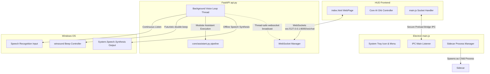

# JARVBOI Desktop Application Architecture

Welcome to the architectural documentation for **Jarvboi**, a premium local AI voice assistant styled after JARVIS. This document details the systems design, component interactions, runtime environment, background voice activation pipeline, and WebSocket protocol specification.

---

## 🏛️ System Design Overview

Jarvboi is built as a hybrid local application combining three decoupled systems into a unified desktop client:

1. **Electron Wrapper (Desktop Orchestrator)**: Manages OS-level features, custom frameless window creation, standard system tray operations, and the lifecycle of the sidecar Python backend process.
2. **Vite Frontend (HUD WebApp)**: Serves a high-fidelity glassmorphic neon dashboard that handles user messaging, displays streaming thought diagnostics, and animates the core AI orb.
3. **FastAPI Backend (AI & Speech Engine)**: Orchestrates local tool executions, interfaces with Ollama/Gemini, and runs an offline, continuous background voice activation system.



---

## 🎙️ Continuous Voice Activation Pipeline

The most critical capability of Jarvboi is its background wake-word activation, which remains active even when the Electron window is minimized or hidden in the tray.

### The Background Daemon Thread
To avoid blocking FastAPI's main thread and uvicorn's event loop, the server spawns a dedicated, unblocked Python background thread on startup:

```python
# Startup event triggers the thread
@app.on_event("startup")
async def startup_event():
    global main_loop
    main_loop = asyncio.get_running_loop()
    voice_thread = threading.Thread(target=background_voice_loop, daemon=True)
    voice_thread.start()
```

### Wake Word Lifecycle & Transition Flow

```mermaid
sequenceDiagram
    autonumber
    participant Mic as Microphone (Input)
    participant Thread as Background Voice Loop
    participant WS as WebSocket Broker
    participant UI as Vite HUD Orb
    participant LLM as AI Assistant Pipeline
    participant TTS as System Speech (Output)

    Note over Thread: Calibrated for ambient noise
    
    rect rgb(10, 20, 30)
        Note over Mic, Thread: Stage 1: Idle Listening
        loop Continuous Listening
            Thread->>Mic: listen_mic(timeout=3, limit=3)
            Mic-->>Thread: Speech captured
            Note over Thread: Check if "Jarvis" / "Jarvboi" in text
        end
    end

    rect rgb(0, 40, 60)
        Note over Thread, UI: Stage 2: Activation Triggered
        Thread->>Thread: Play Beep Chime (1200Hz -> 1600Hz)
        Thread->>WS: Broadcast state: "listening"
        WS->>UI: Animate Orb: Active LISTENING State (pulsing cyan)
    end

    rect rgb(50, 40, 20)
        Note over Mic, Thread: Stage 3: Command Capture
        Thread->>Mic: listen_mic(timeout=8, limit=9)
        Mic-->>Thread: Spoken Command: "Explain your architecture."
        Thread->>WS: Broadcast: USER (Voice) "Explain your architecture."
        Thread->>WS: Broadcast state: "processing"
        WS->>UI: Animate Orb: Active PROCESSING State (spinning yellow)
    end

    rect rgb(10, 50, 30)
        Note over Thread, TTS: Stage 4: Execution & Response
        Thread->>LLM: execute("Explain your architecture")
        LLM-->>Thread: Final Response text
        Thread->>WS: Broadcast: final_response
        Thread->>TTS: speak(response_text)
        TTS-->>Thread: Vocal execution completed
        Thread->>WS: Broadcast state: "idle"
        WS->>UI: Animate Orb: Slow Pulsating IDLE State
    end
```



---

## 🔌 WebSocket Message Specifications

All communication between the frontend HUD and the sidecar FastAPI backend occurs over WebSockets at `ws://127.0.0.1:8000/ws/chat`. Both text commands submitted via the input box and voice triggers route through this socket.

### Real-Time Event Payloads

#### 1. System Status Update
Sent to transition the visual states of the HUD and AI Orb.
```json
{
  "type": "status",
  "status": "listening" | "processing" | "idle"
}
```

#### 2. User Voice Command Logged
Broadcasts a vocal transcription to display it in the chat interface as an outgoing user message.
```json
{
  "type": "voice_command",
  "message": "Spoken command transcription string"
}
```

#### 3. AI Pipeline Thoughts
Streams the real-time reasoning steps of the LLM parser.
```json
{
  "type": "thought",
  "thought": "Thinking process reasoning..."
}
```

#### 4. Tool Execution Triggered
Logs when the assistant activates a system automation tool (e.g. searching the web, terminal automation).
```json
{
  "type": "tool_start",
  "tool_name": "open_website",
  "tool_args": {
    "url": "https://google.com"
  }
}
```

#### 5. Tool Response Received
Reports the outcome of a modular tool execution.
```json
{
  "type": "tool_end",
  "tool_name": "open_website",
  "result": "Success"
}
```

#### 6. Final Assistant Response
Delivers the final output which is also spoken vocally.
```json
{
  "type": "final_response",
  "response": "Here is the architectural review..."
}
```

#### 7. System Diagnostic Notification
Logs general system information, connection states, or warnings.
```json
{
  "type": "system",
  "message": "🎙️ Jarvis Activated. Listening..."
}
```

---

## ⚙️ Desktop Window & Process Lifecycle

The Electron main script (`electron-main.js`) acts as the absolute process controller, ensuring the sidecar server never runs orphaned:

1. **Python Spawn**:
   * Electron resolves the path to the workspace's virtual environment (`venv/Scripts/python.exe` on Windows).
   * Spawns `api.py` as a background sidecar. It specifies `windowsHide: true` to suppress CMD terminal console flash.
2. **Standard Stream Pipes**:
   * Pipes backend stdout/stderr directly into Electron console logs (`console.log` / `console.error`) to simplify developer diagnostics.
3. **Systray Integration**:
   * Attaches a native icon representing the neon circular orb.
   * Intercepts `window.on('close')` to invoke `event.preventDefault()` and hides the frame (`mainWindow.hide()`), keeping the assistant listening in the background.
4. **Graceful Teardown**:
   * Listeners for `will-quit` send `SIGINT` to the child python subprocess, ensuring the local port and background recording threads close cleanly.

---

## 🎨 Visual Design & Core Orb Animations

The user interface uses CSS-driven hardware-accelerated animations to bring the futuristic Jarvis HUD to life:

| Visual State | Orb Core Style | Orbital Rings Style | Status Label |
| :--- | :--- | :--- | :--- |
| **IDLE** | Soft white-cyan radial gradient; steady `30px` cyan shadow. | Three rings rotating slowly in opposite directions (`spin`, `spin-reverse`). | `IDLE` (Steady) |
| **LISTENING** | Glow expands to `60px` cyan-blue shadow; dynamic size pulse keyframes. | Ring borders brighten to full white-cyan; spin speed accelerates to `1.5s`. | `LISTENING...` (Neon ripple) |
| **PROCESSING** | Scale increases to `1.2`; color shifts to neon yellow-orange. | Ring borders shift to yellow/red warning colors; rotation doubles in speed. | `PROCESSING...` (Pulsing yellow) |

---

## 💻 Developer Guide & Commands

### Development Setup
Start the Vite development compiler and Electron in dev mode concurrently:
```powershell
# In terminal 1 (serve UI)
cd ui
npm run dev

# In terminal 2 (start Electron with sidecar)
npm start -- --dev
```

### Production Bundling
Compile the Vite frontend into a static bundle so it runs entirely offline under Electron's `file://` protocol:
```powershell
# Run the root build script (triggers Vite build in ui/dist)
npm run ui-build
```
This writes files into `ui/dist/` with relative reference paths (`base: './'`), loading assets flawlessly without any active dev server.
