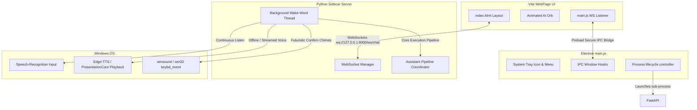

# 🌟 JARVBOI - Completed Features & Capabilities

Welcome to the definitive documentation of the current capabilities of **Jarvboi**—a premium, local, JARVIS-inspired AI voice assistant built with a hybrid Electron, FastAPI, and LLM (Gemini/Ollama) architecture. 

This document details all implemented features, the modular design system, and the step-by-step instructions to boot, develop, and run the assistant on Windows.

---

## 🏛️ System Architecture Recap

Jarvboi operates as a decoupled, multi-process desktop app consisting of three primary layers:
1. **Electron Shell (Orchestrator)**: Manages window layout, standard system tray operations, frameless window settings, and controls the FastAPI sidecar backend process.
2. **FastAPI Backend (Orchestrator & Speech Daemon)**: Manages the WebSocket connection to the UI, exposes standard REST endpoints, runs the background thread for voice activation, and calls Python automation tools.
3. **Glassmorphic HUD (Vite / HTML & CSS & JS)**: Displays real-time conversation history, streams background LLM thoughts/tool logs, and features a CSS-animated AI Orb matching the assistant's state.
4. **Resilient LLM Routing & WSL Auto-Launch (Ollama 🔄 Gemini)**:
   - *Status Verification*: Checks local Ollama connection on requests if Ollama is the preferred provider.
   - *Conversational WSL Start*: If offline, the assistant prompts the user: *"Would you like me to start it in WSL?"*. Affirmation (e.g. *"yes"*, *"ok"*) launches `wsl ollama serve` in the background and waits for connection.
   - *Switch to Gemini Prompt*: If the WSL startup fails or if the user declines starting Ollama, the assistant asks: *"Would you like me to switch to Gemini instead?"*. It only switches if the user explicitly confirms, otherwise remaining in Ollama mode.
   - *State-Aware Wake-Word Bypass*: When the assistant is actively awaiting confirmation (WSL startup or Gemini switch), the background voice listener thread dynamically bypasses the `"Jarvis"` wake-word lock. It listens directly for your response, enabling fluid, multi-turn dialogue without repeating the wake word.

---



---

## 🎙️ Wake-Word & Continuous Voice Activation Pipeline

Jarvboi runs a background voice listener thread that operates independently from the main web server loop. This keeps the assistant responsive to voice commands even when minimized to the system tray.

*   **Microphone Auto-Calibration**: At boot, the microphone measures and auto-adjusts its audio energy thresholds (1.5 seconds) to calibrate for ambient background noise.
*   **Local Wake-Word Listener**: Runs an offline, lightweight listening loop checking for `"Jarvis"` or `"Jarvboi"`.
*   **Futuristic Audio Feedback**: Upon detecting the wake-word, it plays a dual-tone chime (1200Hz to 1600Hz) indicating it is in command capture mode.
*   **Dual-Backend Speech Recognition (STT)**:
    *   *Google Web Speech API*: A fast, lightweight, and low-latency cloud recognition service. Recommended for immediate response. Can be configured with `STT_LANGUAGE` (e.g. `en-IN` for Indian accents or `en-GB` for British English) in the `.env` file to drastically improve accuracy and prevent word misinterpretations.
    *   *Local Faster-Whisper Engine*: A fully offline transcription engine using the local `faster-whisper` library (defaults to the `tiny.en` model). Automatically falls back to Google Web Speech API if Whisper fails to initialize. Uses Silero VAD (Voice Activity Detection) filter parameters to suppress silence transcription and prevent ambient hallucinations.
*   **Robust Confirmation Retry Loop**: If a confirmation reply (like *"sure"* or *"yes"*) is spoken but misunderstood as noise (raising `UnknownValueError`), it prompts: *"I didn't catch that. Could you please repeat?"* and retries up to 3 times, rather than immediately timing out.
*   **Real-time Vocal Feedback**: Speeds up vocal feedback during long operations by executing voice synthesis (`speak()`) immediately as intermediate `final_response` steps are yielded (e.g., announcing the start of WSL Ollama before checking the server), rather than waiting for the entire tool chain loop to terminate.
*   **Edge-TTS Voice Generation (TTS)**: Translates responses into speech using Microsoft’s premium neural voice `en-GB-RyanNeural`.
*   **Audio Redirection**:
    *   *UI Mode*: Base64 audio streams over WebSockets and plays directly in the frontend browser context.
    *   *CLI Mode*: Saves a temporary MP3 file to the local `scratch/` folder and plays it in a non-blocking background thread via Windows PowerShell and `System.Windows.Media.MediaPlayer`.
*   **Lockout Prevention**: The microphone listener suspends capture during assistant speech playback to prevent self-transcription feedback loops.

---

## 🎨 High-Fidelity Glassmorphic HUD UI

The user interface is designed to resemble a premium sci-fi holographic interface (HUD).

*   **Glassmorphic Aesthetic**: Translucent styling with CSS background filters, neon borders, and interactive cyber grids.
*   **State-Aware AI Orb Animations**:
    *   🔵 **IDLE**: Soft white-cyan radial gradient with slow, nested counter-rotating outer orbital rings.
    *   🟢 **LISTENING**: Bright neon cyan glow expanding to double size, pulsing rhythmically as it captures audio.
    *   🟡 **PROCESSING**: Color shifts to bright yellow-orange with orbital rings spinning at double speed as the LLM thinks or runs tools.
    *   🟣 **SPEAKING**: Pulsing neon green-blue halo matching visual TTS output.
*   **Streamed Diagnostics Panel**: Shows a live feed of the assistant's internal thinking steps, parameters for called tools, and system diagnostic logs (e.g. WebSocket connection state).
*   **Frameless Window Control**: Integrates standard minimize-to-taskbar and close-to-tray controls directly in the HUD header.

---

## ⚙️ Unified Automation Tool Registry & Execution

The assistant employs a dynamic `ToolRegistry` that handles parameters, type mappings, and JSON schemas for LLM ingestion.

### 1. Start Menu Shortcut Caching (`desktop_launch_application`)
*   **Mechanism**: Recursively scans the Windows Start Menu directories at startup to compile a database of local shortcuts.
*   **Performance**: Retrieves and starts apps (e.g., `"Spotify"`, `"Discord"`, `"Notepad"`) in `<2ms` from cache.
*   **Fallbacks**: Automatically does a fresh directory scan if a shortcut is missed, or spawns the program through Windows command shell (CMD) if it is a default system path.

### 2. Desktop Window Focus Manager (`desktop_focus_window`)
*   **Mechanism**: Scans active process window titles.
*   **Action**: Matches titles (e.g. `"Firefox"`, `"Spotify"`) to bring the window into the active foreground.
*   **Win32 Fallback**: Employs native `ctypes` bindings targeting `EnumWindows` and `SetForegroundWindow` if high-level window APIs are blocked.

### 3. AI-Powered Visual Pointer Grounding (`desktop_visual_click`)
*   **Mechanism**: Takes a background screenshot using `mss`, downscales/compresses the image for latency, and uploads the frame to Gemini Vision.
*   **Action**: Gemini returns normalized coordinates `[0-1000]` for a descriptive request (e.g., *"the YouTube tab in Firefox"* or *"the close button"*).
*   **Pointer Control**: The coordinates are mapped to physical screen size and clicked using `PyAutoGUI` with human-like easing curves.

### 4. Interactive Web Browser Agent
*   **Tools**: `browser_navigate`, `browser_click`, `browser_type`, `browser_close`.
*   **Mechanism**: Operates an interactive browser session via standard Playwright automation.
*   **Capabilities**: Opens pages, navigates links, enters text forms, and automatically detects and dismisses cookies/privacy consent dialogs.

### 5. Media Controls & Web Integrations
*   **System Media Control (`system_media_play_pause`)**: Calls low-level Windows keyboard hooks to send global `VK_MEDIA_PLAY_PAUSE` commands, letting you control background music or video players.
*   **YouTube Search/Playback (`search_youtube`, `youtube_play_video`)**: Automatically navigates to YouTube, enters search terms, clicks the first matching result, and starts video playback.

---

## 🔧 Environment Configuration (`.env`)

Create a `.env` file in the project root to configure the engine parameters:

```env
# Define active LLM provider (gemini or ollama)
LLM_PROVIDER=gemini
GEMINI_API_KEY=your-gemini-api-key-here
GEMINI_MODEL=gemini-2.5-flash

# (Fallback / Offline Mode) Ollama settings
OLLAMA_HOST=http://localhost:11434
OLLAMA_MODEL=mistral

# Playwright Browser Mode
BROWSER_HEADLESS=False
BROWSER_CONNECT_CDP=True
BROWSER_CDP_URL=http://localhost:9222
```

---

## 🚀 How to Launch & Run Jarvboi

### 📋 Prerequisites
1. **Python**: Python 3.10 or higher.
2. **NodeJS**: Standard LTS release (v18+).
3. **Ollama (Optional)**: If running local offline mode, ensure Ollama is installed and running with `ollama run mistral`.

### 🛠️ Initial Installation

1. Create and activate a Python virtual environment in the root:
   ```powershell
   python -m venv venv
   .\venv\Scripts\activate
   ```
2. Install Python dependencies:
   ```powershell
   pip install -r requirements.txt
   # Install automation libraries
   pip install playwright pygetwindow pyautogui mss edge-tts speechrecognition pyaudio pillow
   playwright install
   ```
3. Install Node.js dev tools in the root and UI folder:
   ```powershell
   # Install Electron wrapper tools
   npm install
   
   # Install Vite compiler tools
   cd ui
   npm install
   cd ..
   ```

---

### 💻 Execution Commands

#### Option A: Full Desktop App (Electron HUD + FastAPI Sidecar)
*   **Development Mode** (Runs Vite live-reload server and Electron debugger side-by-side):
    ```powershell
    # Terminal 1: Serve Vite UI
    npm run ui-dev

    # Terminal 2: Spawn Electron shell with debugger flag
    npm start -- --dev
    ```
*   **Production Built Mode** (Compiles static offline assets and runs completely offline):
    ```powershell
    # Compile Vite frontend UI bundle to ui/dist
    npm run ui-build

    # Boot Electron shell and the production FastAPI sidecar
    npm start
    ```

#### Option B: Standalone Voice-Activated Service (No UI)
Runs the continuous background wake-word thread and answers via local PowerShell voice synthesis:
```powershell
.\venv\Scripts\python.exe voice_assistant.py
```

#### Option C: Standalone Python Console Loop
Runs a standard interactive text console loop in the terminal:
```powershell
.\venv\Scripts\python.exe main.py
```
