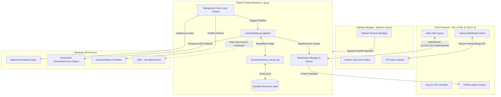

# 🤖 JARVBOI - Premium Local AI Voice Assistant & Automation Hub

[](https://opensource.org/licenses/MIT)
[](https://www.python.org/)
[](https://nodejs.org/)
[](https://www.microsoft.com/windows)

Welcome to **Jarvboi**, a premium, local, JARVIS-inspired AI voice assistant designed to automate your Windows desktop. By combining a multi-process architecture (Electron wrapper, Vite HUD, and FastAPI backend) with state-of-the-art LLMs (Gemini & Ollama), Jarvboi offers offline-first continuous listening, high-fidelity UI visual indicators, and visual click coordination via computer vision.

---

## 🌟 Key Features

*   🎙️ **Continuous Voice Activation**: Runs a low-latency, offline background voice thread listening for the wake word `"Jarvis"` or `"Jarvboi"` with microphone auto-calibration at boot.
*   🧠 **Obsidian Hybrid Memory (V2)**: A persistent, long-term memory vault structured inside an Obsidian graph. It features semantic fact extraction, importance scoring, custom wikilinking, and an offline Jaccard/vector embedding index with periodic self-reflection and summarization.
*   🎨 **Neon Glassmorphic HUD UI**: A futuristic, translucent HTML/CSS dashboard with an animated AI Orb that pulses, rotates, and shifts colors dynamically to reflect the assistant's state (`IDLE` 🔵, `LISTENING` 🟢, `PROCESSING` 🟡, `SPEAKING` 🟣).
*   🛠️ **Unified Automation Tool Registry**:
    *   `desktop_launch_application`: Scans and caches Start Menu shortcuts to open programs in `<2ms`.
    *   `desktop_focus_window`: Brings running desktop applications to the foreground via native Win32 window-handle focus hooks.
    *   `desktop_visual_click`: Captures viewport screenshots, passes them to Gemini Vision to resolve target coordinates, and clicks target elements using `PyAutoGUI` with human-like easing.
    *   `browser_*` (Playwright Agent): Automates logins, button clicks, form fields, and navigates websites.
    *   `youtube_*` & `system_media_*`: Searches YouTube and plays video streams, or controls global OS media keys.
*   ⚡ **Immediate Interruption Protocol**: WebSocket events instantly pause audio playback and interrupt execution loops when the user clicks the AI Orb or types a manual query.
*   🔄 **Resilient LLM Routing & WSL Auto-Launch**: Gracefully falls back to Gemini 2.5 Flash if local Ollama is offline. Automatically prompts the user to start Ollama in WSL, bypassing wake words for confirm dialogues (`yes`/`no`).
*   📝 **Dynamic Skill Writer**: Automatically detects multi-step task completions and prompts to save the sequence as a permanent Python tool/skill.

---

## 🏛️ System Architecture

Jarvboi is built on a modular, decoupled design splitting frontend visualization, desktop system operations, and AI engine computations into separate subprocesses:



---

## 📁 Repository Directory Structure

```
jarvboi/
├── api.py                    # FastAPI server & WebSocket manager
├── main.py                   # Standalone CLI interactive chat loop
├── voice_assistant.py        # Standalone CLI background voice assistant
├── electron-main.js          # Electron app entry point
├── electron-preload.js       # Preload scripts bridging IPC events
├── package.json              # NPM script configuration & Electron dependencies
├── requirements.txt          # Python dependencies
├── ARCHITECTURE.md           # Deep-dive engineering design and specifications
├── FEATURES.md               # Detailed feature inventory & capabilities list
│
├── core/
│   ├── assistant.py          # LLM pipeline coordination, tool calls, and confirmations
│   └── state.py              # State machine definitions for the assistant
│
├── services/
│   ├── db_service.py         # Relational database integrations (SQLite)
│   ├── event_bus.py          # Pub/Sub system decoupling modules via callback events
│   ├── llm_service.py        # API client for Gemini and Ollama providers
│   ├── memory_service.py     # Aggregator connecting working memory and long-term memory
│   ├── skill_service.py      # Autonomously generates, writes, and imports code-based skills
│   └── speech_service.py     # STT transcription and edge-tts neural voice generation
│
├── tools/
│   ├── registry.py           # Decorator and validator schema for assistant tool registration
│   ├── browser.py            # Playwright automation functions
│   ├── desktop.py            # Win32 desktop focus, app shortcut scanner, and visual click
│   ├── system.py             # System media hooks
│   └── youtube.py            # YouTube searching and playing automation
│
├── automation/
│   ├── browser_agent.py      # Low-level browser browser tasks executor
│   └── desktop_agent.py      # High-level desktop automation agent
│
├── memory/                   # V2 Obsidian Memory engine
│   ├── vault.py              # Obsidian file parsing, YAML serialization, and collision handling
│   ├── scorer.py             # Importance evaluating heuristics
│   ├── extractor.py          # LLM entity-relationship extractor
│   ├── indexer.py            # Long-term memory vector indexer
│   ├── graph.py              # Entity wikilinking & semantic memories graph rebuild
│   ├── retriever.py          # Graph/vector-based semantic context retrievers
│   └── reflector.py          # Background reflection daemon summarizing daily events
│
├── ui/                       # Vite FrontendHUD dashboard
│   ├── index.html            # Futuristic hologram dashboard layout
│   ├── main.js               # WebSocket messaging, audio queuing, and DOM animations
│   ├── style.css             # Glassmorphic cyberpunk CSS styles & orb animations
│   └── package.json          # Frontend Vite script dependencies
│
├── tests/
│   ├── run_tests.py          # Stark Industries diagnostic and test suite coordinator
│   └── test_*.py             # Unit/integration test suites
│
└── Obsidian/
    └── Memories/             # Markdown directories (People, Projects, Concepts, Daily, etc.)
```

---

## ⚙️ Environment Configuration (`.env`)

Configure your application properties by copying the environment variables below into a `.env` file in the project root:

```env
# Active LLM Provider (gemini or ollama)
LLM_PROVIDER=gemini
GEMINI_API_KEY=your_gemini_api_key_here
GEMINI_MODEL=gemini-2.5-flash

# Offline / Fallback Local Ollama Settings
OLLAMA_HOST=http://localhost:11434
OLLAMA_MODEL=mistral

# Playwright Browser Configuration
BROWSER_HEADLESS=False
BROWSER_CONNECT_CDP=True
BROWSER_CDP_URL=http://localhost:9222

# Speech-to-Text Accent Optimization (e.g. en-US, en-GB, en-IN)
STT_LANGUAGE=en-US
```

---

## 🚀 Installation & Launch Guide

### 📋 Prerequisites
*   **OS**: Windows 10/11 (Required for Win32 API interactions, `winsound`, and active application wrappers).
*   **Python**: Python 3.10+ (Ensure Python is added to your environment `PATH`).
*   **Node.js**: Node 18+ (Includes NPM package manager).

---

### 🛠️ Initial Project Setup

1.  **Clone the Repository** and navigate to the project directory.
2.  **Create and Activate a Virtual Environment**:
    ```powershell
    python -m venv venv
    .\venv\Scripts\activate
    ```
3.  **Install Python Libraries**:
    ```powershell
    pip install -r requirements.txt
    pip install playwright pygetwindow pyautogui mss edge-tts speechrecognition pyaudio pillow pywin32
    playwright install
    ```
4.  **Install Node.js Wrapper Dependencies**:
    ```powershell
    # Install root level package dependencies (Electron)
    npm install

    # Install UI folder packages (Vite)
    cd ui
    npm install
    cd ..
    ```

---

### 💻 Launch Commands

#### Option A: High-Fidelity Desktop App (Electron HUD + FastAPI Backend)
To run in **development mode** (supports live-reloading of the Vite HUD and Electron window debugging logs):
*   **Terminal 1** (Start Vite App):
    ```powershell
    npm run ui-dev
    ```
*   **Terminal 2** (Start Electron wrapper & FastAPI Sidecar process):
    ```powershell
    npm start -- --dev
    ```

To run in **production mode** (compiles all static frontend assets and boots the app cleanly):
```powershell
# Build static files
npm run ui-build
# Run application
npm start
```

#### Option B: Standalone Background Voice Assistant (No UI)
Runs the offline continuous listening wake-word loop in the terminal. Responses are announced through local Windows PowerShell audio synthesis:
```powershell
.\venv\Scripts\python.exe voice_assistant.py
```

#### Option C: Interactive CLI Terminal Chat
Runs a simple text-based shell prompt inside the active terminal:
```powershell
.\venv\Scripts\python.exe main.py
```

---

## ⚡ System Diagnostics

Jarvboi includes a diagnostics test runner modeled after Stark Industries diagnostic logs. To verify that all components (audio engines, database systems, vector memory graph parsing, and API endpoints) are functioning properly:

```powershell
.\venv\Scripts\python.exe tests/run_tests.py
```

---

## 📄 License

This project is licensed under the MIT License - see the [LICENSE](LICENSE) file for details.
